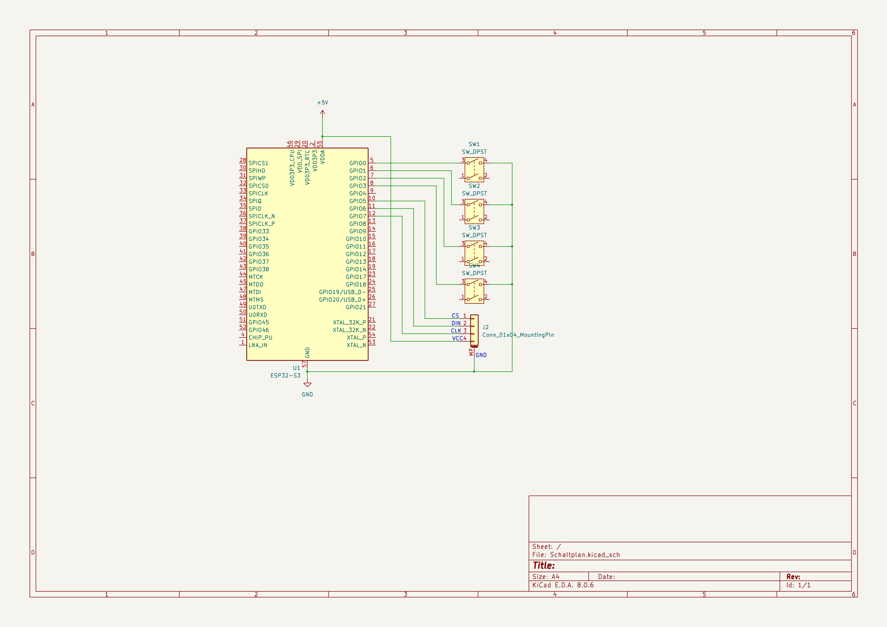

# Embedded Tetris

### Autoren

Nika Sommer

Anton Unger

### Datum

13.08.2025

## Einleitung

### Motivation und Problemstellung

Die Motivation ist die Umsetzung eines bekannten Spiels wie Tetris auf einer begrenzten Embedded-Hardware, dies bietet
eine gute Möglichkeit, theoretisches Wissen aus dem Studium der Informatik in eine praxisnahe und vollständige
Anwendung zu übertragen. Des Weiteren soll das Spielprinzip um eine neue Funktion ergänzt werden, nämlich das es
keine Randbegrenzung gibt. Dadurch können die Blöcke auf der anderen Seite wieder herauskommen.

Am Ende des Projektes soll auf einem 8x32 großen LED-Display das Spiel Tetris dargestellt werden. Die Spiellogik dafür
wird in Rust auf einem ESP32-S3 implementiert. Die Steuerung der Spielblöcke erfolgt über vier Taster. Als Anzeigemodul
wird ein BerryBase MAX7219 4-in-1 LED-Dot-Matrix-Display (8×8, SPI-Bus, 5 V, 10 MHz) verwendet. Die 10 besten
Spielergebnisse sollen über eine Weboberfläche angezeigt werden, sobald eine Verbindung mit dem ESP32-S3 besteht.

### Ziele des Projektes

Das Hauptziel des Projektes ist die Realisierung eines vollständig spielbaren Tetris-Spiels auf der Embedded-Hardware.
Dabei sollen alle Kernfunktionen des Spiels, wie Blockbewegungen, Rotation, Linienlöschung und Punktestand, korrekt
implementiert sein. Ein weiteres Ziel ist die Vertiefung und Erweiterung des Wissens in den unterschiedlichsten
Bereichen wie in der Programmiersprache Rust, von Embedded-Hardware, Echtzeitprogrammierung und Webservern.

### Relevanz und Anwendungsgebiet

Das Projekt verbindet die Hardwarenahe Programmierung, Embedded Systems und Webentwicklung in einer praxisnahen
Anwendung.
Durch die Umsetzung eines bekannten Spiels wie Tetris auf einem ESP32-S3 in Rust, wird der Umgang mit
Mikrocontrollern und Peripheriegeräten wie dem MAX7219 LED-Dot-Matrix-Display, sowie die Implementierung von
Spiel-Logik, Eingabeverarbeitung und Datenpersistenz gelernt.

Das Projekt hat Relevanz für:

* Lern- und Lehrzwecke im Bereich Embedded Systems, um komplexe Logik auf begrenzter Hardware zu realisieren.
* Demonstrationen und Ausstellungen, da Tetris einen hohen Wiedererkennungswert hat und sich gut für Präsentationen
  eignet.
* Grundlagenforschung im Bereich Rust auf Mikrocontrollern, da Rust im Embedded-Bereich noch relativ neu ist und so
  wertvolle Erfahrungen gesammelt werden.
* Prototyping für Spiele oder interaktive Displays mit einfacher Benutzerinteraktion über Taster und Anzeigemodule.

## Technischer Hintergrund

### Relevante Technologien

Das Projekt nutzt Embedded-Programmierung mit der Programmiersprache Rust, für ein ressourcenschonendes, sicheres
und robustes System auf einem ESP32-S3 zu realisieren.

Zentrale technische Aspekte sind:

* Interrupt-gesteuerte Eingabeverarbeitung zur Erfassung von Taster eingaben in Echtzeit.
* LED-Matrix-Ansteuerung über den MAX7219-Treiberchip, der per SPI (Serial Peripheral Interface) kommuniziert und die
  effiziente Übertragung kompletter Bilddaten an mehrere kaskadierte 8×8-Module ermöglicht.
* Persistente Datenspeicherung der Highscores im Non-Volatile Storage (NVS) des ESP32-S3, um Spielstände auch nach einem
  Neustart zu erhalten.
* IoT mit Webserver-Integration direkt auf dem Mikrocontroller, um Spielstände ohne zusätzliche Software über einen
  Browser abrufbar zu machen.

### Verwendete Frameworks, Hardware, Protokolle

Frameworks & Bibliotheken:

* esp-idf-hal – Hardware-Abstraktionsschicht für den ESP32, um GPIOs, SPI und Timer in Rust zu steuern.
* esp-idf-svc – Services wie Logging, Wi-Fi und NVS-Anbindung.
* lockfree – Implementierung einer lockfreien Queue für schnelle, thread-sichere Eingabeverarbeitung.

Hardware:

* ESP32-S3 – Dual-Core-Mikrocontroller mit Wi-Fi, großem Funktionsumfang und Unterstützung für Rust über das
  esp-idf-Ökosystem.
* BerryBase MAX7219 4-in-1 LED-Dot-Matrix-Display – Vier kaskadierte 8×8-Module (32×8 Pixel) mit SPI-Ansteuerung.
* Vier Taster – mechanische Eingabegeräte zur Steuerung der Spielfunktionen (Links, Rechts, Runter, Drehen).

Protokolle & Schnittstellen:

* SPI (Serial Peripheral Interface) – High-Speed-Datenübertragung zwischen ESP32-S3 und LED-Matrix.
* GPIO (General Purpose Input/Output) – direkte Ansteuerung der Taster und Chip-Select-Leitung für das Display.
* Wi-Fi – ermöglicht den Betrieb eines Webservers auf dem Mikrocontroller für die Highscore-Anzeige.

## Projektidee und Anforderung

### Kurze Beschreibung des Konzepts

Das Projekt basiert auf der Idee, Tetris auf einem Embedded-System spielbar zu machen. Über Tasten an der Hardware
können die Spieler die Blöcke steuern, während ein LED- oder Matrixdisplay das Spielfeld visualisiert. Die Software
kümmert sich um die Logik, während die Hardware die Eingaben aufnimmt und die Ausgabe in Echtzeit darstellt.

### Zielgruppe/User

Die Zielgruppe des Projekts umfasst:

* Hobby-Elektroniker und Maker, die Interesse an Embedded-Systemen und Microcontroller haben.
* Software-Entwickler, die ihre Kenntnisse in Rust und Embedded-Programmierung vertiefen möchten.
* Lernende und Studierende, die praxisnah die Kombination von Hardware, Software und Spielmechanik erfahren wollen.
* Fans klassischer Spiele, die Spaß daran haben, bekannte Spiele wie Tetris auf ungewöhnlichen Plattformen zu erleben.

### Funktionale und Nicht-Funktionale Anforderungen

Für die funktionalen Anforderungen soll das System folgendes implementieren:

* Spielsteuerung: Die Blöcke müssen über Tasten bewegt (links/rechts), gedreht und nach unten fallen gelassen werden
  können.
* Anzeige: Das Spielfeld wird in Echtzeit auf dem LED-Display dargestellt.
* Spielmechanik: Linien werden erkannt und gelöscht, Punkte werden gezählt, das Spiel endet bei voller Füllung des
  Spielfeldes.

Für die Nicht-Funktionale Anforderungen gilt Folgendes:

* Zuverlässigkeit: Das System soll stabil laufen und Abstürze vermeiden.
* Reaktionszeit: Eingaben sollen innerhalb von Millisekunden umgesetzt werden.
* Benutzerfreundlichkeit: Die Steuerung soll intuitiv sein, auch für Personen ohne technische Vorkenntnisse.
* Wartbarkeit: Der Code soll modular und gut dokumentiert sein, um Erweiterungen oder Fehlerbehebungen zu erleichtern.

### Erste Skizzen und Diagramme

#### Schaltplan

#### Klassendiagramm

## Architektur und Umsetzung

### Übersicht der Systemarchitektur

### Modulaufbau / Komponenten

### Wichtige Schnittstellen

### Begründung von Entscheidungen

## Implementierung

### Beschreibung zentraler Programmteil

### Eingesetzte Tools und Sprachen

Als Programmiersprache wurde Rust verwendet

## Tests und Ergebnisse

### Was getestet

### Ergebnisse

## Fazit und Ausblick

### Was lief gut, was war schwierig?

### Erfüllung der Ziele

### Lessons Learnd

### Ideen für Weiterentwicklung

## Resportery-Überblick

### Aufbau des Repo

### Setup Anleitung

### Beispiel zur Nutzung

## Lizens und Danksagungen
