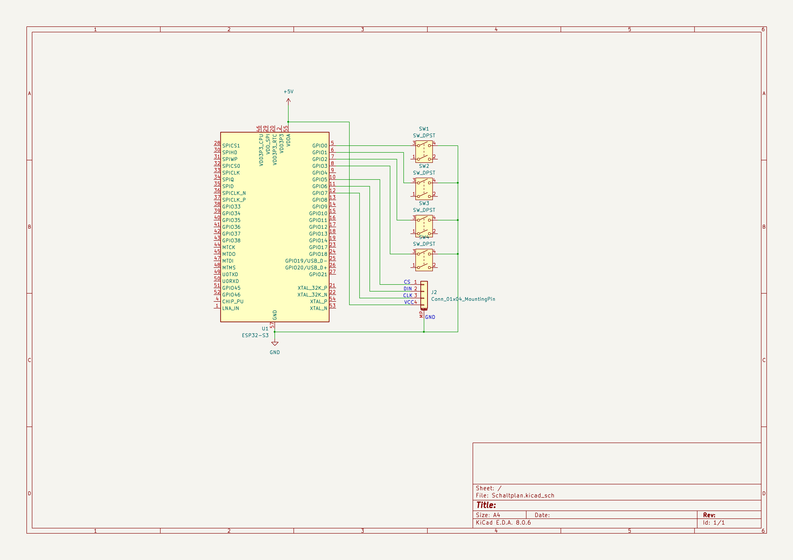
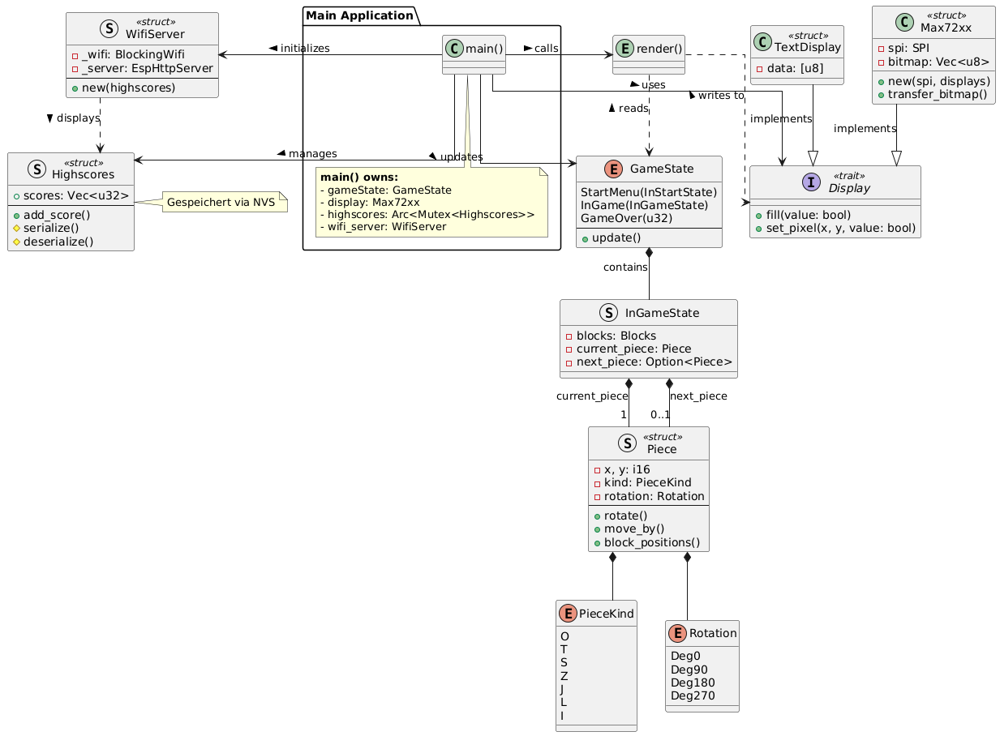
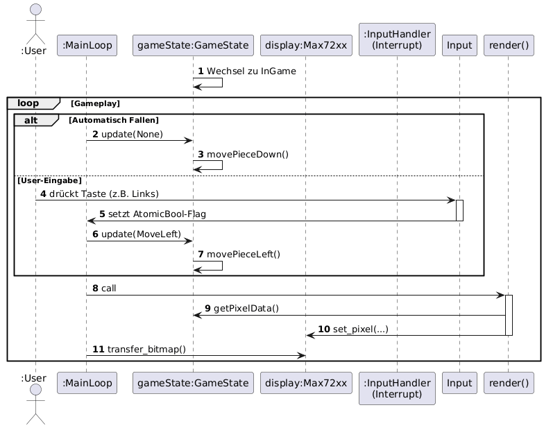
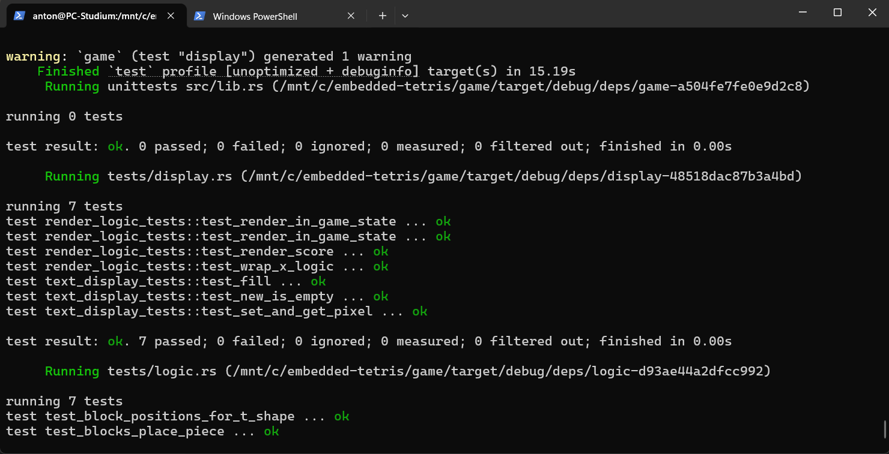
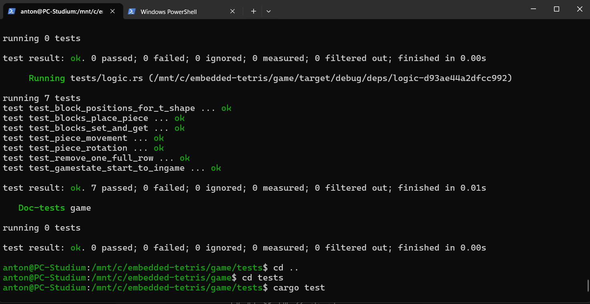
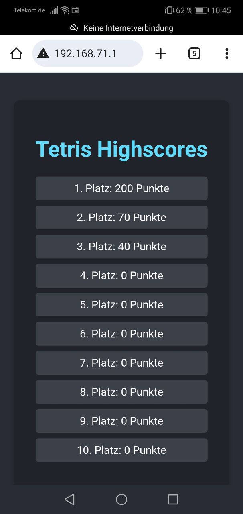
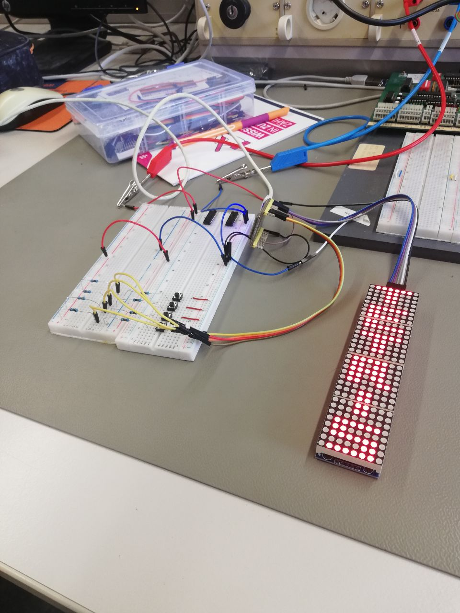

# 🕹️ Embedded Tetris

## 👥 Autoren

**Nika Sommer**  
**Anton Unger**

## 📅 Datum

13.08.2025

---

## 1 Einleitung

### 1.1 Motivation und Problemstellung

Die zentrale Motivation dieses Projekts war die **praktische Anwendung** von im Informatikstudium erworbenem
theoretischem Wissen. Die Umsetzung eines bekannten Spielklassikers wie Tetris auf ressourcenbeschränkter
Embedded-Hardware bot hierfür den idealen Rahmen. Das Projekt stellte uns vor die Herausforderung, eine vollständige
Applikation von der hardwarenahen Ansteuerung bis zur Weboberfläche zu entwickeln.

Eine besondere Anforderung war die **Erweiterung des klassischen Spielprinzips:** Anstelle fester seitlicher
Begrenzungen
sollten die Spielblöcke das Spielfeld an einem Rand verlassen und auf der gegenüberliegenden Seite wieder eintreten
können (Screen-Wrapping).

Das Endprodukt ist ein auf einem ESP32-S3-Mikrocontroller in Rust implementiertes Tetris-Spiel. Die Darstellung des 8x32
Pixel großen Spielfelds erfolgt auf einem kaskadierten MAX7219 LED-Dot-Matrix-Display. Die Steuerung wird über vier
Taster realisiert, und die zehn besten Spielergebnisse werden persistent gespeichert und über eine auf dem ESP32
gehostete Weboberfläche zugänglich gemacht.

### 1.2 Ziele des Projektes

Das Hauptziel war die Entwicklung eines vollständig funktions- und spielfähigen Tetris-Klons auf der ausgewählten
Embedded-Plattform. Dies umfasste die korrekte Implementierung aller wesentlichen Kernfunktionen:

* **Spielmechanik:** Blockbewegungen (links, rechts, unten), Rotation, automatisches Herabfallen der Blöcke, Erkennung
  und
  Auflösung vollständiger horizontaler Linien sowie eine funktionierende Punktevergabe.
* **Anzeige und Steuerung:** Eine flüssige Echtzeit-Darstellung des Spielgeschehens auf dem LED-Display sowie eine
  reaktionsschnelle Verarbeitung der Taster-Eingaben.
* **Highscore-System:** Persistente Speicherung der besten Punktzahlen, die auch nach einem Neustart des Geräts erhalten
  bleiben.
* **Web-Interface:** Bereitstellung einer einfachen Weboberfläche über einen WLAN-Access-Point, um die Highscore-Liste
  abzurufen.

Ein **sekundäres, persönliches Ziel** war die Vertiefung unserer Kenntnisse in der hardwarenahen Programmierung mit
Rust,
der Arbeit mit Embedded-Systemen und deren Peripherie sowie der Integration von Netzwerkfunktionalitäten wie einem
Webserver auf einem Mikrocontroller.

### 1.3 Relevanz und Anwendungsgebiet

Das Projekt verbindet die hardwarenahe Programmierung, Embedded Systems und Webentwicklung in einer
greifbaren Anwendung. Die Implementierung zeigt exemplarisch, wie moderne, sichere Programmiersprachen wie Rust für
komplexe Aufgaben auf Mikrocontrollern eingesetzt werden können.

Potenzielle Anwendungsgebiete und Relevanz des Projekts sind:

* **Lehr- und Lernprojekte:** Als anschauliches Beispiel im Bereich Embedded Systems, um die Realisierung von
  Echtzeitanwendungen auf limitierter Hardware zu demonstrieren.
* **Demonstrationen und Prototyping:** Der hohe Wiedererkennungswert von Tetris eignet sich hervorragend für
  Präsentationen
  auf Messen oder für das Prototyping von interaktiven Displays mit einfacher Benutzerinteraktion.
* **Praxiserfahrung mit Rust:** Das Projekt liefert wertvolle Einblicke in die Stärken und Herausforderungen von Rust im
  Embedded-Bereich, einem noch wachsenden Ökosystem.

---

## 2 Technischer Hintergrund

### 2.1 Relevante Technologien

Das Projekt stützt sich auf die Programmiersprache **Rust**, die aufgrund ihrer Speichersicherheit und
Performance-Eigenschaften eine exzellente Wahl für die Entwicklung robuster Embedded-Systeme ist.

Zentrale technische Aspekte der Umsetzung sind:

* **Interrupt-gesteuerte Eingabeverarbeitung:** Die vier Taster sind über GPIOs angebunden und lösen bei Betätigung
  Interrupts aus. Dies ermöglicht eine reaktionsschnelle und ressourcenschonende Erfassung von Benutzereingaben, ohne
  dass die CPU ständig die Pin-Zustände abfragen muss (Polling).
* **LED-Matrix-Ansteuerung via SPI:** Die Kommunikation mit dem MAX7219-Treiberchip des Displays erfolgt über das Serial
  Peripheral Interface (SPI). Dieses serielle Protokoll erlaubt eine effiziente und schnelle Übertragung der Bilddaten
  an die kaskadierten 8x8-Module.
* **Persistente Datenspeicherung (NVS):** Highscores werden im Non-Volatile Storage (NVS) des ESP32 abgelegt. Dieser
  Flash-Speicherbereich behält seine Daten auch ohne Stromversorgung, wodurch die Spielstände dauerhaft gesichert sind.
* **Integrierter Webserver:** Der ESP32 agiert als WLAN-Access-Point und hostet einen HTTP-Server. Dies ermöglicht es,
  die
  Highscore-Liste plattformunabhängig über einen Webbrowser auf jedem WLAN-fähigen Gerät abzurufen.

### 2.2 Verwendete Frameworks, Hardware, Protokolle

*Frameworks & Bibliotheken:*

* **esp-idf-hal:** Eine Hardware Abstraction Layer (HAL) für Rust, die eine typsichere und high-level Ansteuerung der
  ESP32-Peripherie wie GPIOs und SPI ermöglicht.
* **esp-idf-svc:** Stellt System-Services wie Logging, Wi-Fi-Management und die NVS-Anbindung für das esp-idf-Ökosystem
  bereit.
* **std::sync::atomic:** Zur thread-sicheren Kommunikation zwischen den Interrupt-Routinen (welche die Taster-Eingaben
  registrieren) und dem Haupt-Thread der Spiellogik.

*Hardware:*

* **ESP32-S3-DevKitC-1:** Ein leistungsstarker Dual-Core-Mikrocontroller mit integriertem Wi-Fi, der umfassende
  Unterstützung für das Rust-Ökosystem bietet.
* **BerryBase MAX7219 4-in-1 LED-Dot-Matrix-Display:** Ein Anzeigemodul bestehend aus vier kaskadierten
  8x8-LED-Matrizen,
  was eine Gesamtauflösung von 32x8 Pixeln ergibt.
* **Vier Taster:** Einfache mechanische Schalter für die Spielsteuerung (Links, Rechts, Runter, Drehen).

*Protokolle & Schnittstellen:*

* **SPI (Serial Peripheral Interface):** Wird für die High-Speed-Datenübertragung zwischen dem ESP32-S3 und der
  LED-Matrix
  genutzt.
* **GPIO (General Purpose Input/Output):** Dient zur Abfrage der Tasterzustände (Input) und zur Ansteuerung der
  Chip-Select-Leitung des Displays (Output).
* **Wi-Fi (IEEE 802.11):** Ermöglicht den Betrieb des ESP32 als Access Point für die Bereitstellung des Webservers.

---

## 3 Projektidee und Anforderung

### 3.1 Kurze Beschreibung des Konzepts

Das Projekt realisiert das Spiel Tetris auf einem **autarken Embedded-System**. Ein ESP32-S3 Mikrocontroller steuert die
gesamte Spiellogik, verarbeitet Benutzereingaben und stellt das Spielfeld auf einem **32x8 Pixel LED-Matrix-Display**
dar. Spieler steuern die fallenden Blöcke mit vier Tastern. Eine Besonderheit ist das **Screen-Wrappin**, bei dem
Blöcke, die seitlich aus dem Spielfeld bewegt werden, auf der gegenüberliegenden Seite wieder erscheinen. Die erreichten
Punktzahlen werden **persistent gespeichert** und können über eine vom ESP32 bereitgestellte **Webseite** eingesehen
werden, indem man sich mit dessen WLAN-Netzwerk verbindet.

### 3.2 Zielgruppe/User

Die **Zielgruppe** des Projekts ist breit gefächert und umfasst:

* **Hobby-Elektroniker und Maker:** Personen mit Interesse an der Verknüpfung von Hardware und Software in praktischen
  Projekten.
* **Software-Entwickler:** Insbesondere jene, die ihre Kenntnisse in Rust und im Bereich der Embedded-Programmierung
  erweitern möchten.
* **Studierende:** Als praktisches Projekt zur Anwendung von Konzepten aus den Bereichen Rechnerarchitektur,
  Echtzeitsysteme
  und Softwareentwicklung.
* **Retro-Gaming-Fans:** Enthusiasten, die Freude daran haben, klassische Spiele auf unkonventioneller, selbstgebauter
  Hardware zu erleben.

### 3.3 Funktionale und Nicht-Funktionale Anforderungen

*Funktionale Anforderungen:*

* **Spielsteuerung:** Das System muss die Steuerung der Blöcke (Bewegung nach links/rechts, Beschleunigung nach unten,
  Rotation) über vier dedizierte Taster ermöglichen.
* **Spielmechanik:** Das Spiel muss fallende Blöcke generieren, Kollisionen erkennen, volle Linien auflösen, den
  Punktestand
  zählen und ein "Game Over"-Szenario erkennen, wenn das Spielfeld voll ist.
* **Anzeige:** Das Spielfeld, die fallenden Blöcke und der aktuelle Zustand müssen in Echtzeit auf dem LED-Display
  visualisiert werden.
* **Highscore:** Das System muss eine Liste der Top-10-Punktestände führen, diese nach einem Spiel aktualisieren und
  persistent speichern.
* **Web-Interface:** Das Gerät muss einen WLAN-Access-Point aufspannen und eine Webseite mit der Highscore-Liste
  ausliefern
  können.

*Nicht-Funktionale Anforderungen:*

* **Zuverlässigkeit:** Die Anwendung muss stabil und ohne Abstürze laufen.
* **Reaktionszeit:** Taster-Eingaben müssen ohne spürbare Verzögerung (< 150 ms) verarbeitet und auf dem Display
  widergespiegelt werden.
* **Benutzerfreundlichkeit:** Die Steuerung muss einfach und intuitiv verständlich sein.
* **Wartbarkeit:** Der Rust-Code soll modular und klar strukturiert sein, um zukünftige Erweiterungen oder
  Fehlerbehebungen
  zu vereinfachen.

### 3.3 Erste Skizzen und Diagramme

#### 3.3.1 Schaltplan



#### 3.3.2 Objektdiagramm



#### 3.3.3 Sequenzdiagramm



---

## 4 Architektur und Umsetzung

### 4.1 Übersicht der Systemarchitektur

Die **Systemarchitektur** ist in mehrere logische Schichten unterteilt, um eine klare Trennung der
Verantwortlichkeiten (Separation of Concerns) zu gewährleisten und die Modularität zu erhöhen. Dies erleichtert die
Wartung und Testbarkeitdes Systems.

Die **Architektur** lässt sich wie folgt gliedern:

1. **Hardware Abstraction Layer (HAL):** Die unterste Ebene wird durch die esp-idf-hal-Bibliothek gebildet. Sie
   abstrahiert den direkten Zugriff auf die Peripherie des ESP32-S3 (`GPIO`, `SPI`) und stellt sichere
   Rust-Schnittstellen
   bereit.
2. **Treiber-Schicht:** Auf der HAL aufbauend befindet sich der hardwarespezifische Treiber für die LED-Matrix (
   `display::Max72xx`). Dieser Treiber ist für die direkte Kommunikation mit den MAX7219-Chips über das SPI-Protokoll
   verantwortlich.
3. **Abstraktions-Schicht (Display Trait):** Eine zentrale Komponente der Architektur ist der `display::Display-Trait`.
   Er definiert eine generische Schnittstelle für ein anzeigbares Medium mit den Methoden `set_pixel()` und `fill()`.
   Diese Abstraktion entkoppelt die Spiellogik vollständig von der konkreten Hardware. Für Test- und Debugging-Zwecke
   existiert mit `TextDisplay` eine zweite Implementierung dieses Traits, die das Spielfeld in der Konsole ausgibt.
4. **Rendering-Schicht:** Das render-Modul ist dafür zuständig, den aktuellen Spielzustand (`GameState`) in sichtbare
   Pixel zu übersetzen. Es nutzt den `Display-Trait`, um die entsprechenden Pixel zu setzen, ohne wissen zu müssen, ob
   die Ausgabe auf einer LED-Matrix oder in der Konsole erfolgt.
5. **Logik-Schicht:** Das logic-Modul enthält die komplette Spiellogik, inklusive der Zustandsautomaten (`GameState`),
   der Blockdefinitionen (`Piece`) und der Spielregeln. Diese Schicht ist vollständig unabhängig von jeglicher Ein- und
   Ausgabe.
6. **Applikations-Schicht:** Die `main.rs`-Datei bildet die oberste Schicht. Sie initialisiert alle Hardwarekomponenten
   und Bibliotheken, verarbeitet in einer Endlosschleife die Benutzereingaben, aktualisiert den Zustand der Spiellogik
   und stößt den Rendering-Vorgang an.

### 4.2 Modulaufbau / Komponenten

Das Projekt ist in klar definierte **Rust-Module** unterteilt, die jeweils eine spezifische Aufgabe erfüllen:

* **main:** Einstiegspunkt der Anwendung. Initialisiert Peripherie, NVS und Wi-Fi und führt die zentrale Spielschleife (
  main loop) aus.
* **input:** Konfiguriert die GPIO-Pins als Taster-Eingänge mit Interrupts und stellt atomare Flags (`AtomicBool`) für
  die thread-sichere Kommunikation zwischen Interrupt-Service-Routinen und Hauptschleife bereit.
* **logic:** Beinhaltet die gesamte Spielmechanik. Der `GameState`-Enum (`StartMenu`, `InGame`, `GameOver`) steuert den
  Spielfluss. Hier werden auch die Tetris-Steine (`Piece`) definiert und das Spielfeld (`Blocks`) verwaltet.
* **display:** Kapselt alles rund um die Anzeige. Definiert den zentralen `Display`-Trait, den `Max72xx`-Treiber für die
  LED-Matrix sowie den `TextDisplay`-Treiber für die Konsolenausgabe.
* **render:** Stellt Funktionen bereit, um die verschiedenen Spielzustände auf einem `Display`-Objekt darzustellen.
  Buchstaben- und Zahlen-Bitmaps sind als `const fn` hinterlegt, um Speicher zu sparen.
* **highscore:** Serialisiert und deserialisiert Highscore-Daten und speichert sie persistent im Non-Volatile Storage (
  NVS).
* **website:** Implementiert den Wi-Fi-Access-Point und den HTTP-Webserver zur Anzeige der Highscore-Liste.

### 4.3 Wichtige Schnittstellen

* **`display::Display` Trait:** Zentrale interne Schnittstelle. Entkoppelt die Rendering-Logik von der Display-Hardware
  und ermöglicht einfaches Mocking sowie Tests.
* **SPI (Serial Peripheral Interface):** Hardware-Schnittstelle zwischen ESP32 und MAX7219-Displaytreiber für die
  Übertragung von Bilddaten und Konfigurationsbefehlen.
* **GPIO-Interrupts:** Verbindung zwischen physischen Tastern und Software. Ein Tastendruck löst einen Interrupt aus,
  der von der `input`-Logik verarbeitet wird.
* **HTTP-Server:** Externe Schnittstelle, über die Benutzer per Webbrowser auf die Highscore-Daten zugreifen können.

### 4.4 Begründung von Entscheidungen

**Wahl von Rust:** Rust wurde aufgrund seiner Garantien für Speichersicherheit und seiner Fähigkeit, performanten,
hardwarenahen Code ohne Garbage Collector zu erzeugen, gewählt. Das starke Typsystem und das Ökosystem (`embedded-hal`)
sind ideal für robuste Embedded-Anwendungen.

**Abstraktion durch Display-Trait:** Die Entscheidung, einen generischen Display-Trait zu schaffen, war architektonisch
zentral. Sie ermöglichte die Entwicklung und das Testen der gesamten Rendering- und Spiellogik auf einem PC (über
`TextDisplay`), bevor die Hardware-Implementierung vollständig abgeschlossen war.

**Interrupt-basierte Eingabe:** Anstelle von Polling wurde ein Interrupt-basierter Ansatz für die Taster gewählt. Dies
ist
deutlich effizienter, da die CPU nicht ständig den Zustand der Pins abfragen muss und sich in der Zwischenzeit anderen
Aufgaben widmen kann.

---

## 5 Implementierung

### 5.1 Beschreibung zentraler Programmteil

#### 5.1.1 Interrupt-basierte Eingabeverarbeitung

Das Projekt nutzt einen **Interrupt-basierten** Ansatz, um auf Tastendrücke zu reagieren. Die zentrale Logik hierfür
befindet sich im `input`-Modul.

1. **Globale Flags zur Kommunikation**\
   Es werden vier **globale, atomare boolesche** Variablen deklariert. Diese dienen als **thread-sichere** Brücke
   zwischen dem Interrupt-Kontext (der jederzeit auftreten kann) und der Haupt-Spielschleife.

```rust
// input.rs
use std::sync::atomic::{AtomicBool, Ordering};

pub static BUTTON_LEFT: AtomicBool = AtomicBool::new(false);
pub static BUTTON_RIGHT: AtomicBool = AtomicBool::new(false);
pub static BUTTON_DOWN: AtomicBool = AtomicBool::new(false);
pub static BUTTON_ROTATE: AtomicBool = AtomicBool::new(false);
```

2. **Konfiguration der GPIO-Pins**\
   Die Funktion `setup_button()` konfiguriert einen **GPIO-Pin** für die Eingabe. Sie aktiviert einen internen
   **Pull-Up-Widerstand**, wodurch der Pin standardmäßig auf **HIGH-Pegel** liegt. Der Interrupt wird so eingestellt,
   dass er bei einer **fallenden Flanke (NegEdge)** auslöst – also genau dann, wenn der Taster gedrückt wird und den Pin
   auf LOW-Pegel zieht. Eine übergebene callback-Funktion wird als Handler für diesen Interrupt registriert.

```rust
// input.rs
pub fn setup_button<'d>(
    pin: impl Peripheral<P=impl InputPin + OutputPin> + 'd,
    callback: impl FnMut() + Send + 'static,
) -> Result<PinDriver<'d, impl Pin, Input>, EspError> {
    let mut driver = PinDriver::input(pin)?;
    driver.set_pull(Pull::Up)?;
    driver.set_interrupt_type(gpio::InterruptType::NegEdge)?;
    unsafe { driver.subscribe(callback)? };
    driver.enable_interrupt()?;
    Ok(driver)
}
```

3. **Die Interrupt-Handler**\
   Die Callback-Funktionen selbst (z. B. `gpio_04()`) sind die eigentlichen **Interrupt-Service-Routinen (ISR)**. Sie
   sind bewusst minimal gehalten und setzen lediglich das entsprechende atomare Flag auf true.

```rust
// input.rs
pub fn gpio_04() {
    BUTTON_LEFT.store(true, Ordering::SeqCst);
}
```

Die Haupt-Spielschleife in `main.rs` prüft dann diese Flags, verarbeitet die Eingabe und setzt die Flags wieder auf
false
zurück.

#### 5.1.2 Webserver für Highscore-Anzeige

Um die Highscores anzuzeigen, startet der ESP32 einen eigenen **WLAN-Access-Point** und einen **HTTP-Webserver**.

1. **WLAN Access Point**\
   Die **WifiServer-Struktur** konfiguriert und startet beim Erstellen einen WLAN-Access-Point mit fest definierten
   Zugangsdaten (SSID und Passwort).

```rust
// website.rs
const SSID: &str = "ESP32-Tetris";
const PASSWORD: &str = "tetris123";
```

2. **HTTP-Server und Routen-Handler**\
   Anschließend wird ein HTTP-Server initialisiert. Für den Wurzelpfad (/) wird ein **Handler** registriert, der bei
   jeder Anfrage ausgeführt wird.

```rust
// website.rs
// ... in WifiServer::new()
let mut server = EspHttpServer::new( & Configuration::default ()) ?;

server.fn_handler("/", esp_idf_svc::http::Method::Get, move | request| {
// ...
}) ?;
```

3. **Dynamische HTML-Generierung**\
   Der Handler greift **thread-sicher** auf die Highscore-Liste zu, generiert **dynamisch** eine HTML-Seite und sendet
   diese als
   Antwort an den Client (z. B. einen Webbrowser). Die Funktion generate_html erstellt das HTML-Dokument, indem sie die
   Punktzahlen in eine geordnete Liste einfügt.

```rust
// website.rs
fn generate_html(highscores: &Highscores) -> String {
    let mut body = String::new();

    if highscores.scores.is_empty() {
        body.push_str("<p>Bisher keine Highscores aufgezeichnet.</p>");
    } else {
        body.push_str("<ol>");
        for score in highscores.scores.iter() {
            body.push_str(&format!("<li>Platz: {score} Punkte</li>"));
        }
        body.push_str("</ol>");
    }
    // ... restliches HTML-Grundgerüst
    format!(/* ... */)
}
```

#### 5.1.3 Persistente Highscore-Speicherung

Damit die Highscores einen Neustart des Geräts überdauern, werden sie im **Non-Volatile Storage (NVS)** des ESP32
gespeichert.

1. **Datenstruktur und Speichermanagement**\
   Die **Highscores-Struktur** hält die Punktzahlen in einem Vektor. Die add_score-Methode fügt einen neuen Score hinzu,
   sortiert die Liste absteigend und kürzt sie auf die maximale Anzahl von 10 Einträgen.

```rust
// highscore.rs
const MAX_HIGHSCORES: usize = 10;

// ...
impl Highscores {
    pub fn add_score(&mut self, new_score: u32) {
        self.scores.push(new_score);
        self.scores.sort_by(|a, b| b.cmp(a));
        self.scores.truncate(MAX_HIGHSCORES);
    }
}
```

2. **Serialisierung und Deserialisierung**\
   Da im NVS nur einfache Datentypen wie Strings gespeichert werden können, muss die Liste der Scores (Zahlen) in einen
   String umgewandelt (serialisiert) werden und umgekehrt. Dies geschieht durch Verbinden der Zahlen mit Kommas.

```rust
// highscore.rs
impl Highscores {
    fn serialize(&self) -> String {
        self.scores
            .iter()
            .map(u32::to_string)
            .reduce(|accum, elem| accum + "," + &elem)
            .unwrap_or_default()
    }
    // ... deserialize-Funktion
}
```

3. **Speichern und Laden**\
   Die Funktionen `save_highscores()` und `load_highscores()` schreiben bzw. lesen den serialisierten String in einen
   definierten NVS-Bereich (NVS_NAMESPACE) unter einem festen Schlüssel (NVS_KEY).

```rust
// highscore.rs
pub const NVS_NAMESPACE: &str = "highscores";
const NVS_KEY: &str = "scores_v2";

pub fn save_highscores(
    nvs: &mut EspNvs<NvsDefault>,
    highscores: &Highscores,
) -> Result<(), Box<dyn std::error::Error>> {
    nvs.set_str(NVS_KEY, &highscores.serialize())?;
    Ok(())
}
```

#### 5.1.4 Spiellogik und Zustandsverwaltung

Die Logik des Spiels ist in mehrere Teile aufgeteilt, die den **Spielzustand**, die **Spielstein**e und die *
*Spielregeln** verwalten.

1. **Zustandsautomat (State Machine)**\
   Das gesamte Spiel wird über den **GameState-Enum** gesteuert, der als Zustandsautomat fungiert. Er definiert, ob sich
   das
   Spiel im Startmenü `StartMenu`, im laufenden Spiel `InGame` oder im "Game Over"-Bildschirm `GameOver` befindet. Die
   main-Funktion wechselt basierend auf Spieleraktionen und Spielereignissen zwischen diesen Zuständen.

```rust
// main.rs, basierend auf der Logik in game::logic
// In GameState::update(...)
game_state = game_state.update(button_action.take(), Instant::now(), | score| {
// ...
});
```

2. **Definition der Spielsteine `Piece`**\
   Jeder Spielstein ist durch den **PieceKind-Enum** definiert, der die Form festlegt. Die relative Position der
   einzelnen Blöcke eines Steins wird in `block_offsets` als Tupel von Koordinaten gespeichert.

```rust
// piece.rs
#[derive(Clone, Copy)]
enum PieceKind { O, T, S, Z, J, L, I }

impl PieceKind {
    const fn block_offsets(self) -> &'static [(i8, i8)] {
        match self {
            PieceKind::O => &[(0, 0), (1, 0), (0, 1), (1, 1)],
            PieceKind::T => &[(0, 0), (0, 1), (1, 1), (0, 2)],
            // ... andere Steine
        }
    }
}
```

3. **Bewegung und Rotation**\
   Der **Piece-Struktur** speichert die aktuelle Position (`x`, `y`), den Typ (`kind`) und die Rotation (`rotation`)
   eines Steins. Methoden wie `move_by()` und `rotate()` verändern diesen Zustand. Die tatsächlichen
   Bildschirmkoordinaten jedes einzelnen Blocks werden zur Laufzeit durch die `block_positions()`-Methode berechnet, die
   die Basis-Offsets, die Rotation und die Position des Steins kombiniert.

```rust
// piece.rs
#[derive(Clone)]
pub struct Piece {
    x: i16,
    y: i16,
    kind: PieceKind,
    rotation: Rotation,
}

impl Piece {
    pub fn rotate(&mut self, by: Rotation) {}

    pub fn move_by(&mut self, dx: i16, dy: i16) {
        self.x += dx;
        self.y += dy;
    }
}
```

#### 5.1.5 Ausgabe

1. **Display-Treiber (Max72xx)**\
   Der Treiber für die **MAX7219-LED-Matrix** ist eine zentrale Komponente des Projekts. Er verwaltet einen internen
   Framebuffer (`bitmap`) im Speicher des ESP32, der den Zustand jedes Pixels der 32x8-Matrix abbildet. Änderungen am
   Bild, z.B. durch das Bewegen eines Steins, werden zuerst in diesem **Buffer** vorgenommen. Die Methode
   `transfer_bitmap()` sendet dann den Inhalt des Buffers über **SPI** an die kaskadierten Anzeigemodule. Die Daten
   werden dabei zeilenweise an die entsprechenden Register (`DIGIT0` bis `DIGIT7`) der MAX7219-Chips gesendet. Bei der
   Initialisierung konfiguriert der Treiber die Chips, indem er den Testmodus deaktiviert, die Helligkeit einstellt und
   den Scan-Limit so setzt, dass alle 8 Zeilen angesteuert werden. Die `transfer_row()`-Methode zeigt, wie eine einzelne
   Bildzeile an alle kaskadierten Displays gesendet wird. Der Opcode für die Zielzeile und die 8-Bit-Pixeldaten werden
   dabei zusammen via SPI übertragen.

```rust
// display/ma72xx.rs
fn transfer_row(&mut self, row: u8) -> Result<(), E> {
    assert!(row < 8);

    // Opcode für die zu schreibende Zeile (Digit)
    let opcode = op::DIGIT0 + row;

    // Buffer für alle kaskadierten Displays vorbereiten
    let mut buffer = Vec::with_capacity(self.displays * 2);
    for display in (0..self.displays).rev() {
        let data = self.bitmap[display * 8 + row as usize];
        buffer.extend_from_slice(&[opcode, data]);
    }

    // Daten via SPI senden
    self.spi.write(&buffer)
}
```

2. **Zustandsbasiertes Rendering**\
   Die gesamte **Rendering-Logik** wird durch den globalen **GameState-Zustandsautomaten** gesteuert. Die
   `render()`-Funktion dient als Verteiler, der je nach aktuellem Spielzustand (`StartMenu`, `InGame`, `GameOver`) die
   passende, spezialisierte Zeichenfunktion aufruft.\
   Der **match-Block** in der `render()`-Funktion ist das Herzstück des zustandsbasierten Renderings und delegiert
   die Arbeit an die entsprechenden Unterfunktionen.

```rust
// display/render.rs
pub fn render(game_state: &mut GameState, display: &mut impl Display) {
    match game_state {
        GameState::StartMenu(state) => render_start(state, display),
        GameState::InGame(state) => render_in_game(state, display),
        GameState::GameOver(score) => render_score(*score, display),
    }
}
```

3. **Schrift- und Icon-Bitmaps**\
   Grafische Elemente wie Zahlen oder Buchstaben werden als **statische Bitmaps** direkt im Code gespeichert. Eine const
   Funktion wie `digit_bitmap()` gibt für eine gegebene Ziffer ein Array aus 8 Bytes zurück. Jedes Byte repräsentiert
   eine Zeile auf der 8x8-Matrix, wobei jedes Bit einem Pixel entspricht. Die Verwendung von const Funktion stellt
   sicher, dass diese Daten zur Kompilierzeit direkt in die Firmware eingebettet werden, was zur Laufzeit Speicher und
   Rechenleistung spart. Die Bitmap für die Ziffer '1' ist als Array von 8 Bytes definiert. Jedes Bit im Byte steuert
   eine LED in der entsprechenden Zeile.

```rust
// display/render.rs
const fn digit_bitmap(digit: u32) -> [u8; 8] {
    match digit {
        // Bitmap für die Ziffer '1'
        1 => [
            0b00011000, //   **
            0b00111000, //  ***
            0b00011000, //   **
            0b00011000, //   **
            0b00011000, //   **
            0b00011000, //   **
            0b00111100, //  ****
            0b00000000,
        ],
        // ... Bitmaps für andere Ziffern
        _ => unreachable!(),
    }
}
```

### 5.2 Eingesetzte Tools und Sprachen

Als Programmiersprache wurde **Rust** in der **no_std-Umgebung** (mit `std`-Unterstützung durch das `esp-idf`-Framework)
verwendet. Der Build-Prozess und die Verwaltung von Abhängigkeiten (Crates) erfolgen über Cargo, den
Standard-Paketmanager von Rust.\
Die Entwicklungsumgebung war Visual Studio Code mit der rust-analyzer-Erweiterung und RustRover. Das Flashen der
Firmware auf den ESP32-S3 und das Auslesen der seriellen Konsole wurden mit dem **espflash-Tool** realisiert.

---

## 6 Tests und Ergebnisse

### 6.1 Was wurde getestet

Die interne Spiellogik wurde mit Unit-Tests abgedeckt, um sicherzustellen, dass Kernfunktionen wie Zustandsverwaltung,
Spiellogik und Highscore-Verarbeitung korrekt arbeiten. Die Tests befinden sich Aufgrund der Funktionsweise von Rust in
game/tests/dispaly.rs und game/tests/logic.

### 6.2 `game/tests/dispaly.rs`

Die Datei game/tests/dispaly.rs enthält zwei Test-Module (text_display_tests und render_logic_tests).

#### 6.2.1. text_display_tests

Diese Tests prüfen die TextDisplay-Struktur, also einen Bildschirmpuffer für 8 Pixel breite Spalten und DISPLAY_HEIGHT
Zeilen.

__

`test_new_is_empty`\
Prüft, dass ein frisch erzeugtes TextDisplay leer ist.\
Wie:

1. TextDisplay::new() erstellt ein neues Display.
2. Für jede Koordinate x = 0..8 und y = 0..DISPLAY_HEIGHT wird mit assert!(!display.get_pixel(x,y))
   kontrolliert, dass kein Pixel gesetzt ist.

__

`test_set_and_get_pixel`\
Testet das Setzen und Abfragen einzelner Pixel.\
Wie:

1. Neues Display erstellen.
2. display.set_pixel(3,5,true) setzt das Pixel (3,5).
3. assert!(display.get_pixel(3,5)) prüft, dass es leuchtet.
4. Pixel wieder auf false setzen und erneut prüfen.

__

`test_fill`\
Testet das Füllen des gesamten Displays mit true oder false.\
Wie:

1. display.fill(true) – alle Pixel an.
2. Stichproben bei (0,0) und (7,31) müssen true sein.
3. Danach fill(false) und dieselben Stellen müssen false sein.

#### 6.2.2 render_logic_tests

Diese Tests prüfen die Render-Logik und die Funktion wrap_x.

__

`test_wrap_x_logic`\
Prüft die X-Koordinaten-Umbruchfunktion wrap_x.\
Wie: Erwartungswerte werden mit assert_eq! verglichen:

- wrap_x(0) → 0
- wrap_x(7) → 7
- wrap_x(8) → 0 (rechts herum)
- wrap_x(-1) → 7 (links herum)
- wrap_x(-9) → 7 (mehrfach links)

__

`test_render_score`\
Testet, dass der Render-Code im **GameOver-Zustand** den Score anzeigt.\
Wie:

1. Neues Display, Score = 1234.
2. render(&mut game_over_state, &mut display) aufrufen.
3. Danach kontrollieren, dass bestimmte Pixel (3,0), (2,8), (2,16), (4,24) gesetzt wurden – vermutlich Teile der
   Zahlendarstellung.

__

`test_render_in_game_state`\
Testet das Rendern während eines laufenden Spiels.\
Wie:

1. Leere Blöcke (Blocks), aktuelle Figur T an (3,10), nächste Figur O an (2,2).
2. render aufrufen.
3. Danach prüfen, dass Pixel für Spielfeld, aktuelle und nächste Figur an den richtigen Positionen leuchten, z. B. (
   3,10) für das T-Stück.

__



### 6.3 `game/tests/logic`

Die Datei game/tests/logic enthält einzelne Rust-Tests für Spiellogik, Spielsteine (Pieces), Spielfeld (Blocks) und
Spielzustände (GameState).

---

#### 6.3.1 Tests für Piece (Spielstein)

__

`test_piece_rotation`\
Überprüft die Rotationslogik eines Spielsteins.\
Wie:

1. Neues T-Stück (PieceKind::T) an (0,0).
2. Anfangsrotation muss 0 Grad sein.
3. Nach rotate(Rotation::Deg90) muss Rotation 90 Grad sein.
4. Nach rotate(Rotation::Deg270) wieder 0 Grad (90 + 270 = 360).

__

`test_piece_movement`\
Testet Verschiebung und gezieltes Positionieren eines Steins.\
Wie:

1. Neues O-Stück bei (3,3).
2. move_by(1,-1) verschiebt nach (4,2).
3. move_to(0,0) setzt die Koordinaten direkt auf (0,0).

__

`test_block_positions_for_t_shape`\
Prüft, ob `block_positions()` die korrekten Koordinaten der T-Form liefert, auch nach Drehung.\
Wie:

1. T-Stück bei (3,2), erwartete Positionen für Rotation 0° vergleichen.
2. Dann 90° drehen und erneut erwartete Koordinaten prüfen.

__

#### 6.3.2 Tests für Blocks (Spielfeld)

`test_blocks_set_and_get`\
Testet das Setzen und Abfragen einzelner Felder.\
Wie:

1. Neues leeres Blocks.
2. set(2,5) setzt das Feld (2,5).
3. Prüfen, dass get(2,5) true und get(0,0) false ist.

__

`test_blocks_place_piece`\
Prüft, ob ein ganzer Spielstein korrekt auf dem Spielfeld platziert wird.\
Wie:

1. Leeres Blocks, O-Stück bei (0,0).
2. place_piece(&piece) aufrufen.
3. Alle vier Felder des O-Stücks müssen auf true stehen: (0,0), (1,0), (0,1), (1,1).

__

`test_remove_one_full_row`\
Testet das Entfernen vollständiger Reihen.\
Wie:

1. Unterste Zeile (Index 31) auf 0xff setzen (alle Felder belegt).
2. Vorletzte Zeile (30) mit Teilbelegung.
3. remove_full_rows() aufrufen.
4. Erwartung:

- Rückgabewert = 1 (eine Reihe entfernt).
- Neue unterste Zeile enthält vorherige Zeile 30 (0b00011000).
- Zeile 0 ist leer (0x00).

---

#### 6.3.3 Test für GameState

`test_gamestate_start_to_ingame`\
Überprüft den Übergang vom Startmenü ins eigentliche Spiel.\
Wie:

1. GameState::StartMenu mit Phase Text anlegen.
2. update(Some(ButtonAction::Rotate), …) ausführen.
3. Sicherstellen, dass der neue Zustand GameState::InGame(_) ist.

---



Für hardware-spezifische Komponenten (z. B. GPIO-Interrupts, WLAN-Access-Point, NVS-Speicher) wurden hingegen keine
automatisierten Tests implementiert. Diese Funktionen wurden manuell auf dem ESP32 ausgetestet, da sie stark von der
Hardware-Umgebung abhängen.

### 6.4 Ergebnisse

Alle implementierten Funktionen haben wie geplant funktioniert.\
Die Spiellogik lief stabil, die Highscore-Speicherung und -Anzeige funktionierten zuverlässig, und auch die
Interrupt-basierte Eingabeverarbeitung hat ohne Probleme geklappt.

#### 6.5 Webseite



#### 6.6 Finaler Aufbau



#### 6.7 Funktion

[Video](../assets/test.mp4)

---

## 7 Fazit und Ausblick

### 7.1 Was lief gut, was war schwierig?

Gut funktioniert hat die Implementierung der Spiellogik sowie die Anbindung des Webservers und der
Highscore-Speicherung.\
Herausfordernd waren dagegen folgende Punkte:

* **Störung der Taster:** es mussten teilweise mit externen Pull-Up-Widerständen gelöst werden.
* **Einarbeitung in Rust:** da dies für manche eine Ungewohnte Programmiersparche war.
* **ESP-IDF-Toolchain unter Windows:** die Unterstützung war nicht durchgängig stabil und erforderte Workarounds.
* **LED-Matrix:** es musste eigener Code für die Ansteuerung geschrieben werden, da keine passende Bibliothek verfügbar
  war.

### 7.2 Erfüllung der Ziele

Alle **Kernziele** wurden erreicht:

* Steuerung über Taster funktioniert.
* Spiellogik läuft stabil.
* Highscores können gespeichert und über einen Webserver angezeigt werden.

### 7.3 Lessons Learnd

* Frühzeitiges Testen der Hardware spart später viel Zeit.
* Rust bietet durch Sicherheit und Typensystem Vorteile, erfordert aber anfangs eine steilere Lernkurve.
* Klare Trennung zwischen Logik und Hardware-spezifischem Code erleichtert die Wartung.

### 7.4 Ideen für Weiterentwicklung

* Erweiterung der Spielmechanik (z.B. neue Modi oder Schwierigkeitsgrade).
* Unterstützung für mehrere Spieler über Netzwerk.
* Automatisierte Tests für Hardware-nahe Komponenten durch Simulationen oder Mocks.

---

## 8 Resportery-Überblick

### 8.1 Aufbau des Repo

* **assets:** Bilder für die Dokumentation
* **embedded:** Code der für die Hardware
* **game:**
    * display, Code für display
    * logic, Spiel logik

### 8.2 Setup Anleitung

1. Repository klonen
2. Rust installieren (mit rustup)
3. ESP-IDF-Toolchain einrichten (Linux/macOS empfohlen)\
   siehe https://github.com/esp-rs/espup (Anleitung und Download)
4. Projekt bauen und auf ESP32 flashen mit 'cargo run'

### 8.3 Beispiel zur Nutzung

* Nach dem Flashen startet der ESP32 automatisch das Spiel im Startmenü.
* Verbindung mit dem WLAN-AP ESP32-Tetris (Passwort: tetris123) herstellen.
* Im Browser http://192.168.4.1/ öffnen, um Highscores anzuzeigen.
* Steuerung erfolgt über die angeschlossenen Taster.

---

## 9 Lizenz und Danksagungen

### 9.1 Lizenz

Dieses Projekt steht unter der **MIT-Lizenz**.  
Das bedeutet konkret:

* Der Quellcode darf frei genutzt, verändert und weitergegeben werden.
* Auch kommerzielle Nutzung ist erlaubt.
* Es gibt keine Gewährleistung oder Haftung durch die Autoren.

### 9.2 Danksagungen

Besonderer Dank gilt:

* der Rust-Community für hilfreiche Crates, Dokumentation und Unterstützung,
* den Entwicklern von **ESP-IDF** und **esp-idf-hal**,
* allen, die beim Testen und Debuggen geholfen haben.  
